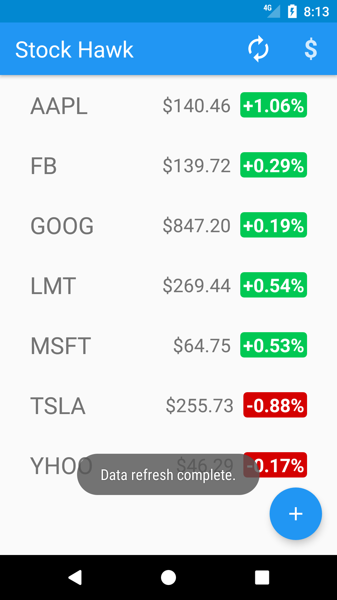
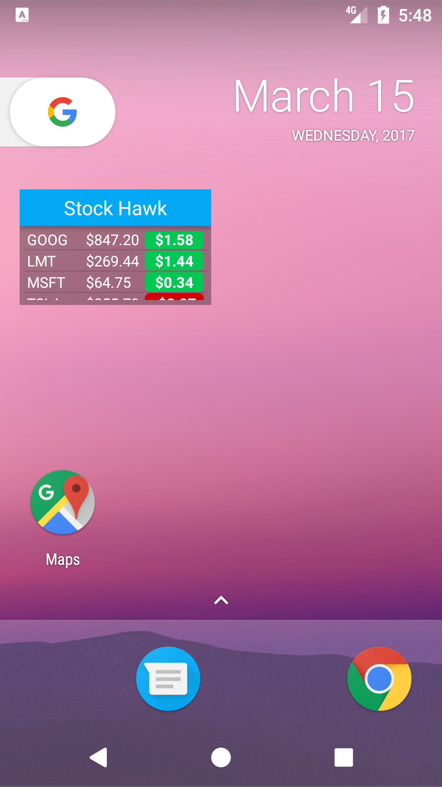
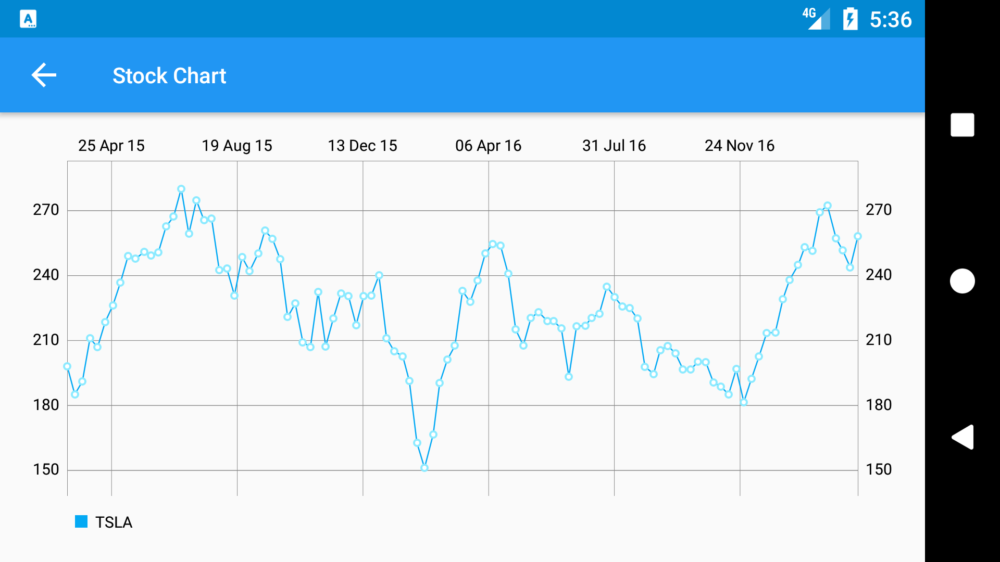
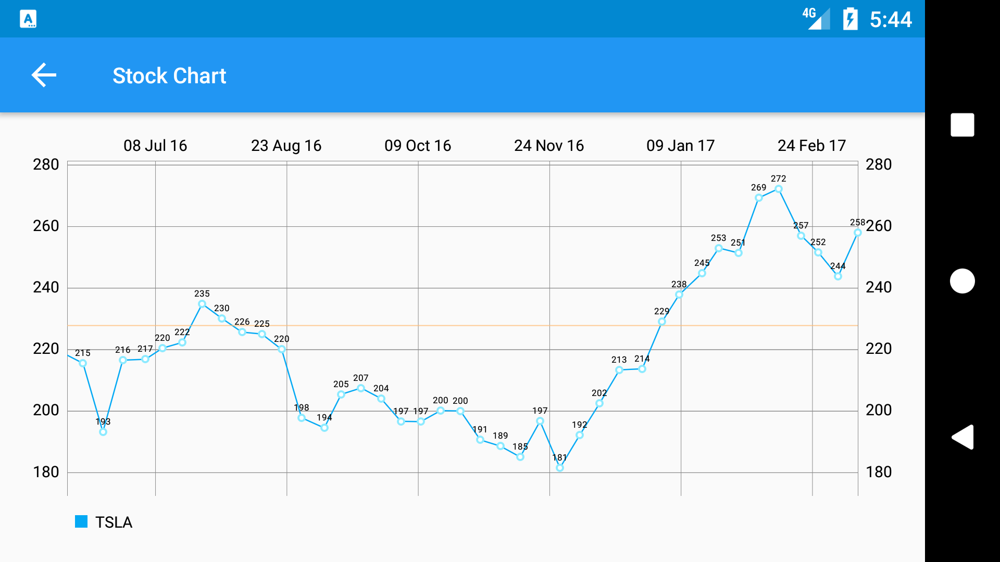

# Stock Hawk

This app is a project for Udacity's Nanodegree program Advanced Android Development course.  It uses a java [yahoofinance-api](https://github.com/sstrickx/yahoofinance-api) library to fetch stock data from Yahoo Finance and [MPAndroidChart](https://github.com/PhilJay/MPAndroidChart) library to plot individual stock prices in a chart.

Key Features:

1) Supports Google Talkback accessibility feature
2) Use of 3rd party libraries to fetch and present data
3) App state retention via SharedPrefences
4) Right to left layout support via flexible layout design
5) Internationalization support for Egyptian Arabic translation via alternate strings.xml resource
6) Fragment based UI design with optimized layout for phones and tablets
7) Custom widget for a quick summary of stock data

## Screenshots

### Phone:

#### Main Screen phone portrait view (left), phone widget (middle) and tablet portrait view (right)

### Stock chart phone landscape normal (top), slightly zoomed in (bottm)

### Tablet horizontal layout

